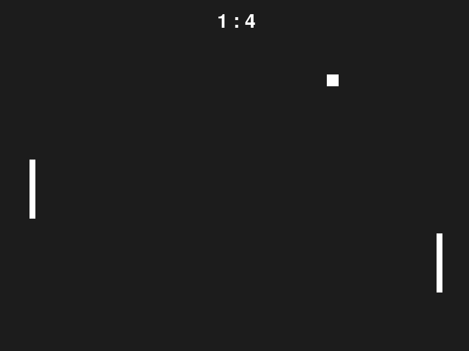

# Pong – Two-Player Pong Game with Pygame

This is a classic Pong game implemented in Pygame. Two players compete to score points by hitting the ball past the opponent’s paddle. The game increases ball speed after each score to make things more challenging.

---

## 🕹️ Gameplay

- Two players play:
  - Left player: `W` (up), `S` (down)
  - Right player: `↑` (up), `↓` (down)
- The goal is to score by getting the ball past the opponent’s side.
- After each point, the ball resets to the center.
- The ball gradually speeds up after every score.

---

## 🧱 Structure

- **Pygame window:** 800x600 pixel playing field
- **Game elements:**
  - Left and right paddles
  - Ball that changes direction on collision
  - Score display at the top
- **Speed increase:** Ball gets faster with each round

---

## 🛠️ Installation & Running

### Requirements

- [Python 3](https://www.python.org/)
- [Pygame](https://www.pygame.org/news)

Install with pip:

```bash
pip install pygame
```

### Running the game

Save the file as `pong.py` and run:

```bash
python pong.py
```

---

## 🧠 Features Overview

- Real-time two-player Pong game  
- Increasing difficulty via faster ball  
- Wall and paddle collision detection  
- Score display  

---

## 📷 Screenshot

```markdown

```

---

## 📄 License

This project is free to use for learning purposes.

---

**Have fun playing! 🏓**

---

# Pong – Kétjátékos Pong játék Pygame segítségével

Ez egy klasszikus Pong játék Pygame-ben megvalósítva. Két játékos egymás ellen játszik, a cél az ellenfél legyőzése pontszerzéssel. A játék folyamatosan növeli a labda sebességét, hogy fokozza a kihívást.

---

## 🕹️ Játékmenet

- Két játékos játszik:
  - Bal oldali játékos: `W` (fel), `S` (le)
  - Jobb oldali játékos: `↑` (fel), `↓` (le)
- A cél az, hogy a labdát az ellenfél oldalán túlra juttassuk.
- Minden pontszerzés után a labda újraindul középről.
- A labda minden kör után egyre gyorsabb lesz.

---

## 🧱 Felépítés

- **Pygame ablak:** 800x600 pixel méretű játéktér
- **Játék elemei:**
  - Bal és jobb oldali ütő (paddle)
  - Labda, amely irányt vált az ütközések során
  - Pontszámláló a képernyő tetején
- **Sebességnövekedés:** A labda sebessége nő minden pontszerzés után

---

## 🛠️ Telepítés és futtatás

### Követelmények

- [Python 3](https://www.python.org/)
- [Pygame](https://www.pygame.org/news)

Telepítés pip-pel:

```bash
pip install pygame
```

### A játék futtatása

Mentse a fájlt `pong.py` néven, majd futtassa:

```bash
python pong.py
```

---

## 🧠 Funkciók összefoglalása

- Kétjátékos Pong játék valós időben  
- Növekvő nehézség a gyorsuló labda révén  
- Pályahatárok és ütőütközés detektálása  
- Pontszámláló megjelenítése  

---

## 📷 Képernyőkép

```markdown

```

---

## 📄 Licenc

Ez a projekt tanulási célokra szabadon felhasználható.

---

**Jó játékot! 🏓**
